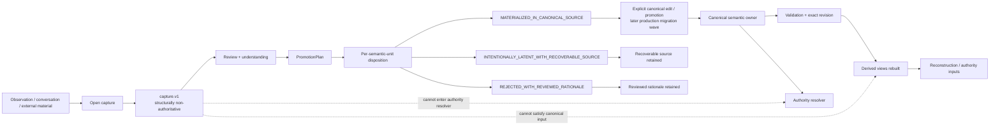

# Knowledge Capture, Review and Promotion Lifecycle

**Purpose:** Make the capture-review-promotion boundary explicit and preserve the rule that capture is non-authoritative until accepted meaning is promoted into a canonical semantic owner.

## Lifecycle diagram



## Capture is not authority

Capture areas are structurally separate from canonical discovery. A valid capture can preserve useful material, provenance and source references, but it cannot:

- satisfy authority resolution;
- satisfy a canonical semantic identity requirement;
- become an input to canonical derived views merely by existing;
- promote itself;
- overwrite a canonical source.

This is a structural rule, not a convention.

## W0 promotion planning

W0 implements and validates a prospective `PromotionPlan`. It does not perform real canonical promotion.

A valid plan requires, at minimum:

```text
accepted review and understanding
one natural canonical target
exact committed target revision
capture provenance
required semantic-unit inventory
complete typed disposition for every required semantic unit
at least one materialized unit
```

Identity remains selective. A promotion target may be addressed by an authored semantic identity when one exists, or by exact carrier plus revision for identity-free sources. Paths never mint new semantic IDs.

## Preservation contract

Promotion is not defined as copying every sentence. Preservation is evaluated over explicit semantic units and provenance.

For every required unit, the plan must say whether the meaning is:

```text
materialized in the canonical source
intentionally latent with a recoverable source
rejected with reviewed rationale
```

Mechanical validation can prove coverage, provenance and revision binding. Human or model review remains responsible for judging whether prose actually realizes accepted meaning where that cannot be decided mechanically.

## Historical capture

After successful future promotion, capture may move to historical storage or be removed according to the preservation contract. Its removal must not destroy the only recoverable copy of accepted meaning or provenance.

## Physical realization

Current W0 implementation uses:

```text
tools/project_knowledge/capture.py
tools/project_knowledge/services/discovery.py
tools/project_knowledge/services/validation.py

docs/project_knowledge/captures/open/
docs/project_knowledge/captures/historical/
```

The directories are designated storage boundaries. W0 does not require real project captures to be migrated into them yet.
