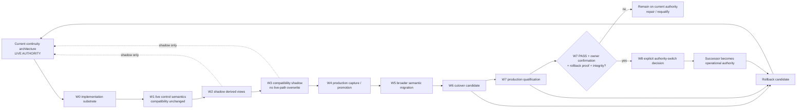

# Migration, Compatibility, Cutover and Rollback

**Purpose:** Make the staged authority transition explicit. Successor implementation and successful shadow generation do not themselves change operational authority.

## Current invariant

Until a later qualified W8 decision:

```text
CURRENT_OPERATIONAL_AUTHORITY=CURRENT_CONTINUITY_ARCHITECTURE
AUTHORITY_SWITCH_ALLOWED=false
```

## Migration and cutover diagram



## Governed waves

### W0: implementation substrate

Create the software, schemas, documentation, generated-area contract and qualification base. Existing canonical sources do not need to adopt declarations during W0.

### W1: live control semantics

Migrate a bounded high-value set of semantic owners, including the selected architecture/workstream, Project Integration Boundary, Source Vault workstream, paused Cockpit workstream and current high-consequence governing sources.

W1 must preserve current compatibility outputs and must not switch authority.

### W2: shadow derived views

Generate the V1 structural views from successor semantic owners and compare them with qualified expectations and current state.

### W3: compatibility shadow

Generate candidate replacements for routing, current-state and Knowledge Map roles without overwriting live paths. Every difference is classified, not silently accepted.

### W4: production capture/promotion

Run one bounded real capture through review and canonical promotion, then prove preservation and provenance.

### W5: broader current migration

Migrate by semantic responsibility or domain, not chronology or file enumeration. Deep passive history stays latent unless continuity requires explicit identity or authority semantics.

### W6: cutover candidate

Only after W0 through W5 acceptance may successor-generated compatibility surfaces replace legacy-authored equivalents in a controlled candidate state.

### W7: production cutover qualification

Re-run the production qualification program against the actual migrated repository, including fresh-session continuation, provider/tool portability, authority/action fidelity, identity/supersession, private boundary, workstream interruption and migration rollback.

### W8: explicit authority switch

Only after W7 PASS, owner confirmation, rollback proof and repository integrity may a separate explicit decision change operational authority.

## Compatibility is not authority

During migration, a successor-generated file may be byte-correct and still remain shadow output. Compatibility paths have an explicit role until cutover. No W0 or W1 implementation may silently change those roles.

## Rollback

Rollback must preserve the ability to return to the last qualified authority state. A cutover candidate is not accepted unless rollback is proven, and a final authority switch remains reversible through an explicit governed recovery path.

## Physical implementation status

W0 through W4 are accepted. W5 is now in progress. Its first bounded substage designs and pressure-tests the future knowledge information architecture and authoring contract before broader current semantic migration begins. No successor-generated compatibility path has overwritten the live continuity surfaces.

Current continuity remains operational authority, successor outputs remain non-authoritative, and no authority switch may occur before the later qualified W8 decision.
