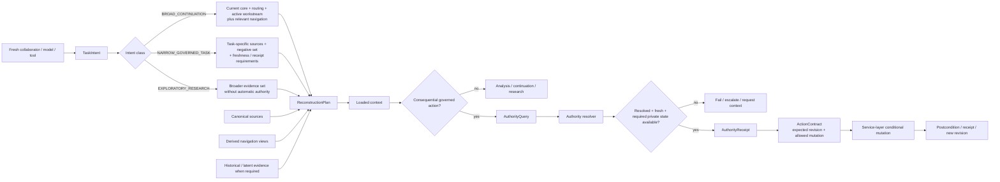

# Reconstruction, Authority and Safe Action

**Purpose:** Describe how a fresh collaborator obtains task-shaped context and how consequential action remains downstream of explicit authority.

## Task classes

The selected architecture distinguishes three reconstruction intents:

```text
BROAD_CONTINUATION
NARROW_GOVERNED_TASK
EXPLORATORY_RESEARCH
```

They are not three authority systems. They are different context-selection problems.

## Focused diagram



## Broad continuation

Broad continuation reconstructs enough current project state to resume work without scanning the entire repository. The current-state core, workstream navigation and subject/source discovery surfaces reduce the default context cost.

Broad continuation does not require the current core to enumerate every dormant project domain. It must expose enough navigation capability to reach relevant latent history when the task requires it.

## Narrow governed task

A narrow task should load the smallest justified source set, including explicit negative or do-not-load boundaries where useful. It can require:

- exact source freshness;
- an authority receipt;
- private-state evidence;
- expected revision;
- governing procedure constraints.

If omitted scope or context can change the governing set, the task remains unresolved rather than guessing.

## Exploratory research

Exploratory research may inspect a broader evidence set and may use search, subject routing or model understanding aggressively. That broader retrieval freedom does not create authority. Research evidence remains evidence until accepted into the relevant canonical semantic owner.

## Action boundary

Consequential mutation is service-layer work. Pure semantic modules determine meaning and resolution; they do not own repository mutation.

The safe pattern is:

```text
understand intent
-> reconstruct context
-> resolve authority
-> bind exact revision
-> form action contract
-> perform conditional mutation
-> verify postcondition
```

A stale expected revision fails before mutation.

## Current W0 physical status

W0 already provides much of the substrate used by this flow: source discovery, deterministic current-state/navigation views, identity, authority and workstream engines, revision validation and safe workstream mutation seams.

The complete reconstruction planner and all later command surfaces are part of the selected architecture but are not all exposed by the current G014 CLI. This document distinguishes that logical contract from the current physical implementation state.
