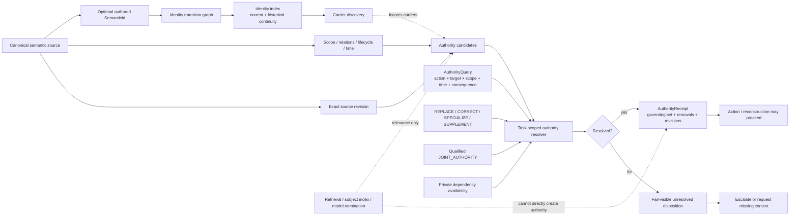

# Semantic Ownership, Identity and Authority

**Purpose:** Show how source ownership, identity continuity, authority and retrieval remain distinct.

## Core distinctions

A canonical source owns meaning because it is the accepted semantic owner for that responsibility. A semantic ID provides continuity when the concept needs durable identity across carriers or representation changes. Authority answers a different question: which current canonical sources govern a particular task under a particular scope, action and time.

Retrieval is subordinate to authority. Search, subject indexes and model understanding may nominate likely relevant sources, but nomination never sets authority disposition.

## Focused diagram



## Identity is not authority

Identity answers continuity questions such as:

- is this the same semantic owner after a move or representation replacement?
- was one identity split, merged, superseded, retired or redirected?
- which carriers belong to its history?

The identity index is derived and rebuildable. It never promotes a source or declares that an identity governs a task.

Meaningful transition classes are:

```text
MOVE_OR_RENAME
REPRESENTATION_REPLACEMENT
MERGE
SPLIT
SUPERSEDE
RETIRE
REDIRECT
```

Transition records exist only when the transition itself carries durable semantic or provenance meaning.

## Authority is task-scoped

Authority resolution consumes explicit current canonical candidates and an explicit query. The resolver evaluates:

```text
candidate collection
-> scope discrimination
-> temporal applicability
-> relation closure
-> qualified joint authority
-> conflict detection
-> exact revision/freshness
-> required private evidence
-> governing procedure constraints
-> deterministic receipt
```

Stable sort order is serialization only. It never creates semantic precedence.

## Scope and time

Scope is a finite conjunction of exact-match facets. A missing query facet is not automatically failure. It becomes `UNRESOLVED_SCOPE_REQUIRED` only when that missing facet can change the resulting governing set.

Temporal controls are evaluated explicitly. Query-independent validation may prove structural temporal correctness, but it does not guess a current evaluation instant when one is required.

## Retrieval remains subordinate

Derived access surfaces can reduce search cost:

```text
source catalog
identity index
authority candidate index
subject index
current-state core
```

Their outputs are inputs to understanding and resolution. None may override canonical ownership or turn relevance into authority.

## Physical realization

Current W0 implementation primarily maps these semantics to:

```text
model.py            typed values
identity.py         identity transition/index semantics
authority.py        task-scoped authority resolution
views.py            deterministic derived-view contracts
pure_*.py          restricted persistent-view projection bodies
view_definitions/   per-view specifications + data-only unit declarations
services/validation.py
services/semantic_validation.py
services/generation.py
```

These files implement the model. They are not themselves the logical model.
