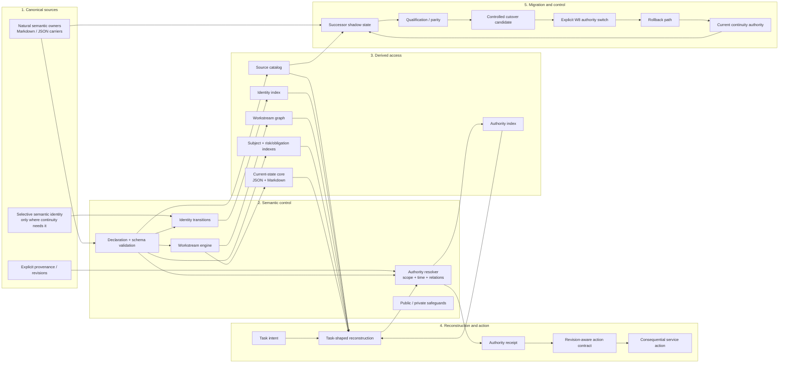

# Whole Project-Knowledge Architecture

**Purpose:** Professional overview of the selected project-development knowledge architecture.
**Logical design authority:** D-035, Requirements V0.2, Specification 028, Research 179.
**Current physical state:** W0-W4 are accepted and finalized where applicable; W5 physical/authoring V0.2 is frozen, C1 per-view implementation-closure granularity is accepted, and T1/T3/T4 remain before broad W5 semantic migration.

## Architectural principle

The architecture separates accepted meaning from access machinery.

Canonical sources own accepted project meaning. Semantic controls make identity, authority, scope, lifecycle, workstream and transition semantics explicit where needed. Derived views accelerate discovery and continuation but contain no unique accepted truth. Reconstruction selects the minimum useful context for a task. Consequential action is subordinate to resolved authority and revision-aware action contracts. Migration remains shadowed until explicit qualification and cutover.

## Whole-architecture overview



## Boundary 1: canonical sources

Canonical knowledge remains in natural semantic owners rather than being copied into a universal database or registry. A governed source may have a semantic ID when continuity requires one, but identity is selective. Paths, titles and hashes never auto-mint semantic identity.

Canonical revision evidence is Git-bound. Durable revisions use exact Git blob bytes at an exact commit. Worktree state may be validated locally but cannot masquerade as durable commit-bound authority evidence.

## Boundary 2: semantic control

Semantic controls are explicit only where they add meaning:

- profile-specific strict declarations and schemas;
- typed scope and relation semantics;
- identity transitions for meaningful continuity changes;
- authority resolution over current canonical candidates;
- workstream DAG, lifecycle and resume semantics;
- public/private dependency and non-leakage constraints.

Authority is task-scoped. The system does not infer authority from retrieval rank, path order, lexical order, or convenience.

## Boundary 3: derived access

Persistent structural views are deterministic, deletable and rebuildable:

```text
source_catalog.json
identity_index.json
authority_index.json
workstream_graph.json
subject_index.json
risk_obligation_index.json
current_state_core.json
CURRENT_STATE_CORE.md
```

These views support navigation, reconstruction and freshness checks. They are not a second source of accepted truth.

Full rebuild and incremental refresh share one builder. Incremental operation selects affected views, then recomputes each selected view from its complete current input set.

## Boundary 4: reconstruction and action

A model or human may express task intent, but deterministic project-controlled logic owns the boundary after intent formation. The selected architecture distinguishes broad continuation, narrow governed work and exploratory research.

Retrieval narrows what is examined. It does not decide what governs. Consequential action requires resolved authority plus revision-aware action semantics. If authority, scope, freshness, private evidence or expected revision is unresolved, the system fails visibly rather than inventing certainty.

Some reconstruction and action surfaces are architectural contracts for later migration waves and are not all physically exposed by the W0 CLI yet.

## Boundary 5: migration and control

The successor architecture is introduced under shadow qualification. Existing continuity remains operational authority through W0 and W1 and until a later explicit W8 decision.

The migration program separates:

```text
implementation substrate
-> live semantic owners
-> shadow derived views
-> compatibility shadow
-> production capture/promotion
-> broader semantic migration
-> cutover candidate
-> cutover qualification
-> explicit authority switch
```

Rollback remains explicit. A generated successor artifact becoming technically available never constitutes authority cutover by itself.

## Physical implementation map

The current repository realization is intentionally shallow:

```text
schemas/project_knowledge/
    strict profile and manifest schemas

tools/project_knowledge/
    model.py
    declaration.py
    references.py
    identity.py
    authority.py
    workstreams.py
    views.py
    capture.py
    pure_*.py

    view_definitions/
        common.py
        one view-definition module per view
        units_*.py

    adapters/
        gitio.py
        fsio.py
        schema.py
        pure.py
        execution.py
        generated_io.py

    services/
        discovery.py
        validation.py
        semantic_validation.py
        generation.py
        refresh.py
        workstream_ops.py
        cli_ops.py

    cli.py

docs/project_knowledge/
    architecture/
    generated/          # generated only when explicitly materialized
    captures/           # migration waves create governed capture content later
    transitions/        # semantic transition carriers when naturally required
    joint_authority/    # exceptional joint-authority carriers when qualified
```

The logical concepts above are not defined by these paths. The paths are the current implementation of the selected contracts.

## Layering

```text
L0 model/value objects
    -> stdlib

L1 adapters
    -> L0

L2 semantic/domain modules
    -> L0

L3 services/orchestration
    -> L0 + L1 + L2

L4 CLI
    -> L0 + L3
```

Pure semantic algorithms receive value objects and bytes, not live repository handles. Architecture tests enforce the import direction.

## Non-goals

The selected architecture does not require a graph database, vector database, universal semantic-ID registry, universal ontology, generated authority registry, or model-owned hidden state. Those mechanisms may exist elsewhere for other purposes, but they are not substitutes for the project-knowledge authority model.
